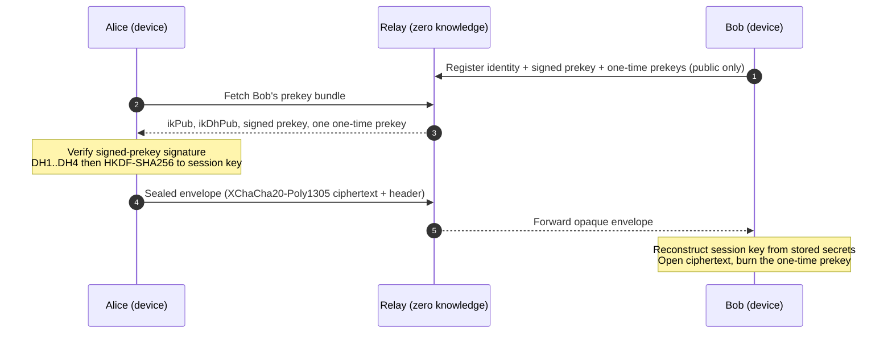
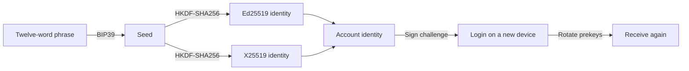
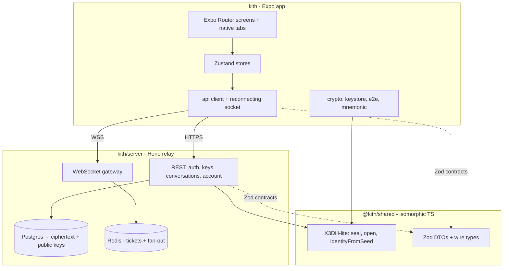

<div align="center">

# Kith

### The private-by-default messenger. End-to-end encrypted before your message ever leaves the phone.

Real-but-lean X3DH key agreement, XChaCha20-Poly1305 sealed messages, a passwordless key-based login, and a twelve-word recovery phrase that only you hold. Built with Expo SDK 57 and a Hono relay that never sees your plaintext.

<br />

[](https://docs.expo.dev/versions/v57.0.0/)
[](https://reactnative.dev/)
[](https://www.typescriptlang.org/)
[](https://hono.dev/)
[](LICENSE)

[](#security-model)
[](#security-model)
[](#security-model)
[](#account-recovery)
[](#security-model)

<a href="#quick-start"><b>Quick start</b></a> &nbsp;&middot;&nbsp;
<a href="#security-model"><b>Security model</b></a> &nbsp;&middot;&nbsp;
<a href="#architecture"><b>Architecture</b></a> &nbsp;&middot;&nbsp;
<a href="zero-to-deploy.md"><b>Zero to deploy</b></a> &nbsp;&middot;&nbsp;
<a href="#faq"><b>FAQ</b></a>

</div>

---

## Why Kith

Most messengers ask you to trust their servers. Kith is built so you do not have to. Every message is sealed on your device with a key the server never learns, the account is a keypair rather than a phone number, and the only backup is a phrase you write down. If the relay operator, a network attacker, or a court subpoenas the database, what they get is ciphertext and routing metadata, not conversations.

This repository is the full stack: the Expo app, a shared cryptography package that runs byte-for-byte the same on the client and the server tests, and a Hono relay you can bring up locally with one Docker command.

> Kith is engineered to be honest about what it does. The app only exposes what is actually wired to the encrypted transport. Features that are not implemented yet are absent, never faked. See [What is shipped](#what-is-shipped-vs-planned).

---

## Highlights

| Area | What you get |
| --- | --- |
| **Default end-to-end encryption** | Every message, 1:1 or group, is sealed on-device with XChaCha20-Poly1305. The relay forwards opaque envelopes it cannot read. |
| **Real key agreement** | X25519 Diffie-Hellman with an X3DH-lite prekey handshake, so the first message is asynchronous and still authenticated. |
| **Encrypted groups and communities** | A group message is encrypted once with a fresh key that is sealed to each member individually; a community is a directory of encrypted group channels. |
| **Encrypted media** | Images, voice, documents, and stickers are encrypted with a per-file key and uploaded as ciphertext; the key travels sealed in the message. |
| **Passwordless identity** | No phone number, no password. You prove control of your Ed25519 identity key by signing a server challenge. |
| **Seed-phrase recovery** | Your identity is derived from a BIP39 phrase. Write it down once, restore on any device. The server holds no recovery secret. |
| **Encrypted local history** | Messages persist on-device as ciphertext, sealed with a data key that lives only in the secure enclave. Nothing readable touches disk. |
| **Right to erasure** | Delete your account for real: the relay drops your data and the device wipes every key. |
| **Native feel** | Expo Router with real native tabs, FlashList threads, dark and light theming, and a splash handoff with no light-mode flash. |
| **Zero-knowledge relay** | Postgres stores only ciphertext plus public key material. Redis carries single-use realtime tickets and per-user fan-out. |

---

## What is shipped vs planned

Kith ships a complete, real encrypted messenger. It does not pretend to be more than it is: every surface below is wired to the encrypted transport, and anything not yet built is honestly absent in a live build rather than faked.

**Shipped and wired to the real encrypted transport**

- One-to-one and group messaging, end-to-end encrypted
- Communities with channels (each channel is an encrypted group)
- Media over the transport: images, voice notes, documents, stickers, location, contacts, polls (only sealed blob refs reach the relay)
- Reactions, message pins, forward, edit, and delete-for-everyone
- Disappearing messages (a shared per-conversation timer)
- Delivery and read receipts, typing indicators, presence
- Remote push that reaches a force-quit app (content-free, so no message text leaves the device)
- Server-enforced block, mute, and real safety-number verification
- History hydration, gap-detectable sync, and encrypted local persistence
- Passwordless registration and login, seed-phrase recovery, QR-code add, real account deletion

**On the roadmap (not yet built)**

- Double Ratchet for forward secrecy and post-compromise security
- Voice and video calls
- Multi-device sync for a single identity

In a live build (when the app points at a relay), any not-yet-built surface is hidden rather than shown as a working control. See [Configuration](#configuration).

---

## Security model

Kith uses an X3DH-lite handshake: Alice fetches Bob's signed prekey bundle, performs a set of X25519 Diffie-Hellman operations, derives a session key with HKDF-SHA256, and seals the message with XChaCha20-Poly1305. The routing header is bound as authenticated data, so a relay cannot swap the key path without breaking decryption.



**What the relay can see:** who talks to whom, timing, message sizes, and public keys. **What it cannot see:** message contents, and any secret key.

**Cryptographic primitives**

| Purpose | Primitive | Library |
| --- | --- | --- |
| Identity signatures and auth challenge | Ed25519 | `@noble/curves` |
| Key agreement | X25519 ECDH | `@noble/curves` |
| Authenticated encryption | XChaCha20-Poly1305 | `@noble/ciphers` |
| Group and media content | XChaCha20-Poly1305 with a per-message / per-file key, that key sealed via X3DH | `@noble/ciphers` + `@noble/curves` |
| Key derivation | HKDF-SHA256 | `@noble/hashes` |
| Recovery phrase to seed | BIP39 | `@scure/bip39` |

Randomness is injected, never assumed. The client uses `expo-crypto`, the server and tests use the Node CSPRNG, so there is exactly one audited crypto implementation and no `get-random-values` polyfill dependency.

**Honest limits.** This is version one. The session key is static per X3DH handshake, so Kith provides confidentiality, sender authentication, and asynchronous first contact, but not forward secrecy or post-compromise security. A Double Ratchet is the upgrade path. The app does not claim perfect forward secrecy anywhere in its interface.

---

## Account recovery

Your account is a twelve-word BIP39 recovery phrase. The identity keys are derived from it deterministically, so the same phrase reproduces the same account on any device with no server-side secret.



On a new phone you enter your username and phrase. Kith rebuilds the identity, signs the login challenge, and rotates a fresh set of prekeys to the relay so peers can seal to the new device. Lose the phrase and no one, the project included, can restore the account. That is the trade-off real privacy asks for.

---

## Architecture

A small monorepo with one rule: the cryptography is written once and shared, so the code the server tests exercise is the same code that runs on the phone.



**Repository layout**

```
kith/
  src/app/            Expo Router routes (src/app structure, native tabs)
  src/crypto/         keystore (secure-store), e2e, mnemonic, random
  src/stores/         Zustand: session + chat (encrypted persist)
  src/api/            REST client, reconnecting socket, query client
  src/net/            transport config, messaging singleton, secure storage
  shared/             @kith/shared: X3DH-lite crypto + Zod DTOs (self-contained)
  server/             Hono relay: routes, ws gateway, Drizzle schema, migrations
  server/docker-compose.yml   Postgres 16 + Redis 7 + relay
```

---

## Tech stack

| Layer | Choices |
| --- | --- |
| **App** | Expo SDK 57, React Native 0.86, React 19, Expo Router, native tabs, TypeScript strict (`noUncheckedIndexedAccess`, `noImplicitOverride`) |
| **State and data** | Zustand, TanStack Query, FlashList, AsyncStorage (ciphertext only), expo-secure-store (secrets) |
| **Crypto** | `@noble/curves`, `@noble/ciphers`, `@noble/hashes`, `@scure/bip39` |
| **Relay** | Hono, `@hono/node-server`, `ws` |
| **Data** | Postgres via `postgres` + Drizzle ORM, Redis via `ioredis` |
| **Testing** | `node:test` with PGlite (in-process Postgres) for real integration tests |

---

## Quick start

You need Node 20 or newer, and Docker for the backend.

```bash
# 1. Install app dependencies
npm install

# 2. Install the shared crypto package (regular deps so it resolves locally and in Docker)
cd shared && npm install && cd ..

# 3. Bring up Postgres, Redis, and the relay
cd server && docker compose up --build
```

Then, in a second terminal, point the app at the relay and start it:

```bash
# real device: your LAN IP; Android emulator: 10.0.2.2; iOS simulator: localhost
echo "EXPO_PUBLIC_API_URL=http://localhost:8787" > .env
npx expo start
```

Without `EXPO_PUBLIC_API_URL`, the app runs a fully offline demo (useful for design work) and the encrypted backend is compiled out. Full instructions, including running the relay without Docker, migrations, and EAS builds, live in [zero-to-deploy.md](zero-to-deploy.md).

---

## Configuration

| Variable | Where | Purpose |
| --- | --- | --- |
| `EXPO_PUBLIC_API_URL` | app `.env` or EAS profile | Relay base URL. Its presence switches the app from offline demo to the real encrypted backend. |
| `DATABASE_URL` | server `.env` | Postgres connection string. |
| `REDIS_URL` | server `.env` | Redis connection string. |
| `SESSION_SECRET` | server `.env` | Signs opaque session ids stored in Redis. Rotate in production. |
| `PORT` | server `.env` | Relay port, default 8787. |

---

## Testing

The crypto and persistence layers are covered by real integration tests that run the shared code against an in-process Postgres.

```bash
cd server && npm test        # crypto vectors + PGlite integration (24 tests)
npm run typecheck            # app: tsc --noEmit (strict)
cd server && npm run typecheck
```

---

## Roadmap

- Double Ratchet for forward secrecy and post-compromise security (needs a cryptography review)
- Encrypted voice and video calls (needs a TURN server and on-device verification)
- Multi-device sync for a single identity
- Invite links and public discovery for communities
- Reproducible builds and a third-party cryptography review

---

## FAQ

<details>
<summary><b>Does the server ever see my messages?</b></summary>
<br />
No. Messages are sealed on your device before they are sent. The relay stores and forwards opaque ciphertext plus routing metadata. It has no key that can decrypt anything.
</details>

<details>
<summary><b>How do I sign in on a new phone?</b></summary>
<br />
Enter your username and your twelve-word recovery phrase. Kith derives your identity from the phrase, logs in by signing a challenge, and publishes fresh prekeys so people can message you again. Messages sealed to your old device before the switch are not recoverable, by design.
</details>

<details>
<summary><b>What happens if I lose my recovery phrase?</b></summary>
<br />
The account is unreachable. There is no reset, because there is no server-side secret to reset from. Back up the phrase when you create the account.
</details>

<details>
<summary><b>Why is there no phone number or email?</b></summary>
<br />
Your account is a keypair. Removing the phone number removes a permanent identifier that ties the account to a real-world identity and a telecom.
</details>

<details>
<summary><b>Is media encrypted too? What about groups?</b></summary>
<br />
Yes. Images, voice notes, documents, and stickers are encrypted end-to-end: the file is encrypted on your device with a per-file key, only the ciphertext is uploaded, and the key travels sealed inside the message, so the relay stores opaque bytes it cannot read. Group and community messages are encrypted too: each message is encrypted once with a fresh key that is then sealed to every member individually. Calls are the one messaging surface not yet built, and a live build hides them rather than faking them.
</details>

<details>
<summary><b>Is this forward secret?</b></summary>
<br />
Not yet. Version one uses a static session key per X3DH handshake. A Double Ratchet upgrade is on the roadmap, and the app never claims forward secrecy it does not have.
</details>

---

## Contributing

Contributions are welcome. The build is production-grade and strict, so a few ground rules keep it that way:

1. Fork and branch from a fresh branch named for the change.
2. Keep TypeScript strict and green: `npm run typecheck` in both the app and `server`.
3. Add or update tests for any change to crypto, persistence, or the relay: `cd server && npm test`.
4. Never write plaintext or a secret key to disk or to the wire. Secrets live in `expo-secure-store`; ciphertext may live in AsyncStorage.
5. Open a pull request against [aashir-athar/kith](https://github.com/aashir-athar/kith) with a clear description and the reasoning behind the change.

Found a security issue? Please open a private report rather than a public issue.

---

## License

Released under the [MIT License](LICENSE). Use it, learn from it, build on it.

---

<div align="center">

### Built by Aashir Athar

[](https://github.com/aashir-athar)
[](https://linkedin.com/in/aashirathar)
[](https://x.com/aashirathar)

If Kith is useful to you, star the repo. It helps other people find privacy-first, open-source software.

</div>
